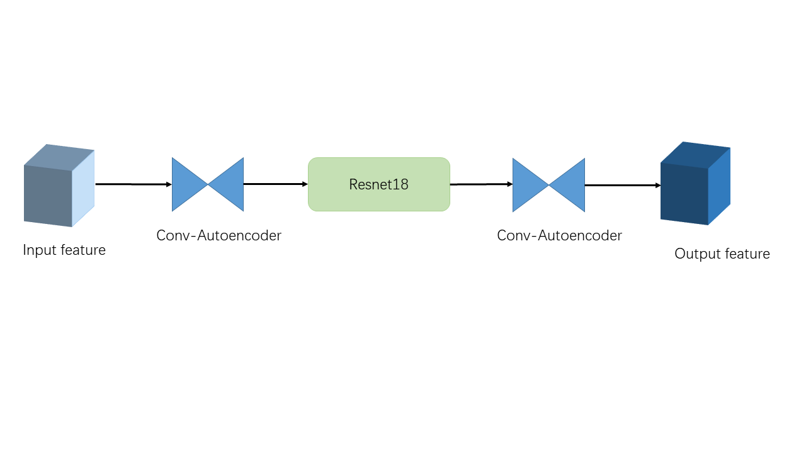
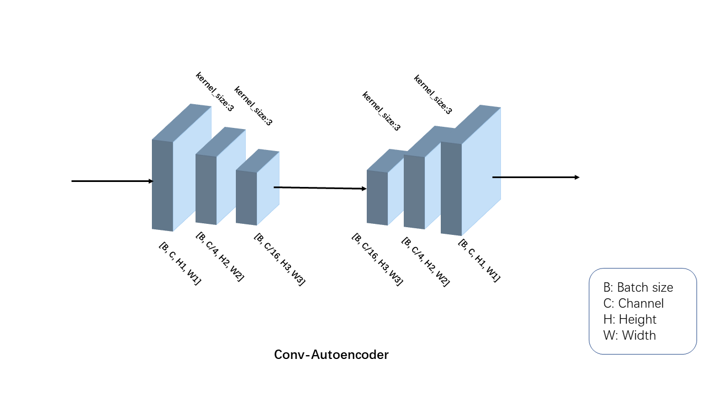

# Introduction

Facial expression recognition based on Resnet18 and convolutional Autoencoder. A real time facial expression detector based on YOLOv5.

# Architecture

# Requirement

- Python 3.x
- Pytorch
- Linux
- A CPU or a GPU with CUDA

# Download dataset and Pretrained model

# How to use it?

- Train FER model: `cd ./FER/; python train.py` or `bash train.sh`
- Predict FER model: `python predict.py`or `bash predict.sh`
- Test the detector : `cd ..; python detect.py`or `bash detect.sh`

# Files and folders in this repo

- `./FER/ ` -> Train and evaluate FER models.
- `./models_fer/resnet_autoencoder.py` ->     The architecture of our model.
- `./detect.py`-> The FER detector.
- `./video/`-> Put video here which you want to test.

# References

https://github.com/WuJie1010/Facial-Expression-Recognition.Pytorch

https://github.com/deepcam-cn/yolov5-face

